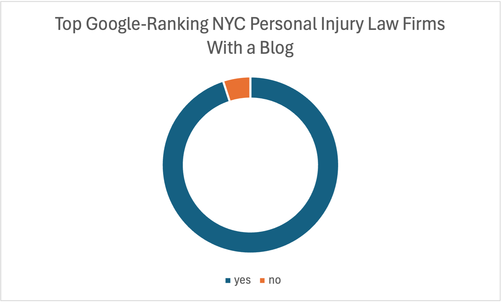
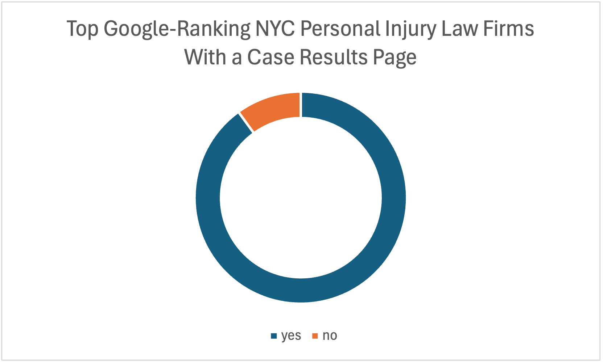

# Personal Injury Blogs and Case Results Pages and Their Impact on SEO
Analyzing storytelling on personal injury lawsuits based on Google search results.

## Overview
This project explores the online presence of personal injury law firms across major U.S. metro areas by examining the prevalence of blogs and case results pages on top-ranking websites. The goal is to identify trends, patterns, and opportunities for marketing strategies within the legal field.

Using SEO insights and measurable data collected from Google search results, I am investigating how these storytelling elements impact visibility on search engines.

## Tools and Technologies
This project relies on the following tools and technologies:
- **SEMRush**: for SERP analysis and data extraction.
- **Screaming Frog**: to crawl websites.
- **Excel**: for processing and organizing data.

## Rationale
As a legal content writer, my work has given me insight into the importance of strong, engaging storytelling in legal marketing—particularly through blogs and case results pages. However, my understanding has been mostly intuitive, built through observation rather than hard data.

The purpose of this project is to validate or challenge my assumptions about the role these content types play in boosting online visibility (SEO) and rankings in competitive search queries such as "personal injury lawyer [city]". If the results confirm patterns, they could serve as actionable takeaways for law firms looking to create optimized, client-driven content that stands out in their market.

This project marks my first formal exploration into data analysis, combining my expertise in legal SEO content with new skills in analytics and visualization.

1. **Defining the Scope**
    - Identify the project parameters:
        1. Select U.S. cities for analysis.
        2. Define the target query: "personal injury [city name]"

2. **Data Collection**
    - Collect data from SEMRush
3. **Data Cleaning and Preparation**
    - Via Excel, remove unhelpful results.
        1. Aggregate sites, like Justia or Avvo
        2. Professional organizations, like the New York State Bar
        3. Government organizations, like the City of New York
    - Limit to the top 20 law firm results.
    - Use Screaming Frog SEO Spider to crawl the websites of the top 20 results.
4. **Exploratory Data Analysis**
    - Use Excel to count how many of the top 20 firms on Google have a blog.
    - Use Excel to count how many of the top 20 firms on Google have a case results page.
    - Use formulas on Google to turn these counts into percentages to 2 decimal places.

## Key Findings
95% of the top Google-ranking NYC law firms maintain a blog.
89% of the top Google-ranking NYC law firms have a case results (or similar) page.

## Visuals

### Blog Prevalence:

### Case Results Prevalence:

## Decisions and Assumptions
### Keyword choice
- Focused on "personal injury [city name]" rather than "personal injury lawyer [city name]" or "personal injury attorney [city name]"
  - *Reason:* Although Google generally includes close variations like "lawyer" and "attorney" when searching, this will avoid that step.
### Tools
- Chose SEMrush for SERP analysis.
  - *Reason:* Highly localized data capabilities
### Defining the Scope
- Chose to start with data from New York City.
  - *Reasons:*
    - Initial familiarity with the market.
    - Largest metro area in the United States.
  - Limiting results to the top 20.
    - *Reason:* I need enough data to be able to draw valid conclusions from, but I suspect that the lower down we get in the SERPS, the more likely we are to start pulling in irrelevant data.
### Data Cleaning and Preparation
- Used Excel's remove duplicates function.
- Used Screaming Frog to identify blog and case results pages.
### Exploratory Analysis
- Used Excel to do a COUNTIF, to determine percentages, and to round the percentages to 2 decimal points.
- Used the COUNTIF results to create donut charts for blogs and for case results pages.

## Additional Notes and Observations
- I need to remain mindful of bias: I came into the project expecting blogs to be the cornerstone of SEO strategies, but the data may prove otherwise.

### Additional Research Questions
- Where do these blogs fall in the AI-written range? 
    - A randomized study of other NYC blogs give us some answers, as well as expanding out to measure some proxy of 'big'.
        - Income per year
        - Number of lawyers
- Is this research applicable to other types of lawyers, beyond personal injury?
